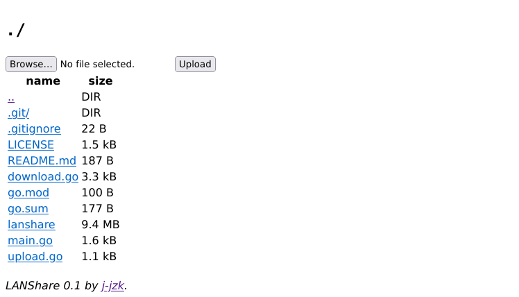

# LANShare
A program to quickly & easily share files on the LAN.
Running LANShare starts a web server which you can open and download files from (upload is also available).

## Example
Running `lanshare -u` and opening `localhost:8080` gives the following result:



## Usage
```
lanshare [-u] [-p <port>] | [-h|-help]
  -h|-help   display help
  -p <port>  the port to listen on (default 8080)
  -u	     whether to allow uploads (default false)
```

